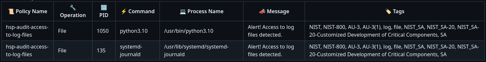
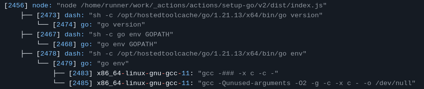

# CI/CD Security by AccuKnox


## Table of Contents
- [Introduction](#introduction)
- [KubeArmor](#kubearmor)
- [Features](#features)
- [Usage](#usage)
- [Inputs](#inputs)
- [Examples](#examples)
- [Troubleshooting](#troubleshooting)
- [Contributing](#contributing)

## Introduction
The CI/CD Scan by AccuKnox is a powerful tool designed to enhance the security of 
your continuous integration and deployment pipelines. By providing comprehensive 
assessment, monitoring, and protection capabilities, it enables you to:

- Detect and prevent potential supply chain attacks in CI/CD environments
- Gain real-time visibility into your pipeline's security posture
- Streamline the integration of security practices into your DevOps workflow

In today's fast-paced software development landscape, where operational efficiency 
is paramount, the CI/CD Scan by AccuKnox empowers DevSecOps teams to deploy with confidence. 

## KubeArmor
KubeArmor is a CNCF project that powers this action to scan the events taking place
in the CI/CD environment such as GitHub runner. KubeArmor uses eBPF monitors to 
watch over the events taking place at system level and uses LSMs (Linux security modules)
for enforcing the security policies either in block or audit mode. 

To learn more about KubeArmor please visit, https://kubearmor.io/ 

We install KubeArmor in systemd mode in the GitHub runner and that lets us watch over
the events and enforce security policies safely. 

## Features
This GitHub action provides you with the necessary information needed for you to 
monitor and view as the events take place in the CI/CD environment. 

### 1) Policy driven alert generation
We apply standard industry policies as baseline security posture of the CI/CD 
environment. This helps you to quickly identify if there is a process, network call
or file event that is taking place that should be audited or blocked. 

We support and apply multiple compliance based security policies that includes 
||
---------------------------------------------------------------------------|------------------------------------------------------------------|----------------------------------------------------------------
MITRE ATT&CK | NIST | CIS

All of our security policy templates are open sourced and can be found here: [Policy Templates](https://github.com/kubearmor/policy-templates)

The alerts generated after the scan of your CI/CD pipeline is completed looks like this


It clearly tells you about the policy itself, the command which caused the generation of alert
and the message itself, which makes it easy for you to understand the nature of alert and
a possible issue in the CI/CD pipeline itself.

### 2) Define your own security policies
Other than providing the baseline as an initial security posture, you can also write your
own security policies and have a more granular control on the CI/CD pipeline. 

Here is an example of a security policy
```yaml
apiVersion: security.kubearmor.com/v1
kind: KubeArmorHostPolicy
metadata:
  name: hsp-kubearmor-dev-proc-path-block
spec:
  nodeSelector:
    matchLabels:
      kubearmor.io/hostname: "*" # Apply to all hosts
  process:
    matchPaths:
    - path: /usr/bin/sleep # try sleep 1
  action:
    Block
```

Please make sure that in `kind` field you set `KubeArmorHostPolicy`. 
The above policy will block the `sleep` call. To read more about how KubeArmorHost 
policies are written and designed please take a look at this: [KubeArmor policy spec for nodes/VMs](https://docs.kubearmor.io/kubearmor/documentation/host_security_policy_specification)

### 3) Process tree and behaviour
We let you see complete process tree that includes a hierarchical view of the 
processes taking place in the pipeline, we do not exclude a single process from 
the view, making sure its easy for you to do a system forensics based analysis.

Here is an example of it:


As you can see, you can clearly observe the parent-child relationship between
processes easily and observe the overall system behaviour.

### 4) Network events
You can also see all the network based events taking place in the system, this 
is very important to identify any egress or ingress network events with the network
protocol, process making the network call and the name of the process itself. 

For example:


<em>We will also support standard network policies in the coming realeases.</em>

## Usage
The usage is as simple as <em>Plug-and-Play</em>, you only have to include the following 
lines in your GitHub workflow and you are all set to go. 

```yaml
- name: AccuKnox CI/CD scan
  uses: accuknox/report-action@v0
```

You can also use the latest version of the release, by visting [accuknox/report-action GitHub](https://github.com/marketplace/actions/accuknox-report)

If you encounter any issues, please feel free to open an issue on the [report-action's repository](https://github.com/accuknox/report-action), or mail to help@accuknox.com 

## Inputs
The action provides certain inputs to help you control how the scan behaves, we
currently provide the following options

| Name              | Default | Type     | Required | Description                                                                                                                                                                                   | Example                                                                                 |
| ----------------- | ------- | -------- | -------- | --------------------------------------------------------------------------------------------------------------------------------------------------------------------------------------------- | --------------------------------------------------------------------------------------- |
| All               | True    | `bool`   | No       | All will lets system collect all the logs from KubeArmor which in turn collects all the events taking place in the runner                                                                     | `all: false`                                                                            |
| System            | False   | `bool`   | No       | This will only collect system events that includes network and process events                                                                                                                 | `system: false`                                                                         |
| KubeArmor version | Latest  | `string` | No       | You can set the specific [release](https://github.com/kubearmor/KubeArmor/releases) version of KubeArmor                                                                                      | `kubearmor_version: '1.3.8'`                                                            |
| Knoxctl version   | Latest  | `string` | No       | This lets you set a specific [release version](https://github.com/accuknox/knoxctl-website/releases) for knoxctl (knoxctl is the tool that parses and scans the CI/CD environment)            | `knoxctl_version: '0.5.1'`                                                              |
| Policy Action     | Audit   | `string` | No       | You can set the policy action to either Audit or Block                                                                                                                                        | `policy_action: block`                                                                  |
| Dryrun            | False   | `bool`   | No       | Setting dryrun to true will not apply any policy but save it as asset which can be downloaded                                                                                                 | `dryrun: true`                                                                          |
| Strict            | False   | `bool`   | No       | Setting strict mode will apply all the policies (by default we omit certain policies which can generate a lot of informational alerts), running in strict mode might generate a lot of alerts | `strict: true`                                                                          |
| Policies          | N/A     | `string` | No       | You can pass the path to user defined policies to be applied on the system                                                                                                                    | `policies: "./path/to/policies.yaml"`                                                   |
| Ignore Alerts     | N/A     | `string` | No       | You can ignore either one of the alerts (file, network or process) to omit them from security report                                                                                          | `ignore-alerts: "file"`                                                                 |
| Minimum Severity  | N/A     | `string` | No       | You can also set the severity level of alert between 1 to 10, (1 being least and 10 being highest severity) all the alerts generated will be higher than the defined severity level           | `min-severity: 5` This will only show alerts which are greater than severity level of 5 |

## Examples
Few examples on how you can use the options given 

#### Running scan in dryrun mode with a specific knoxctl and KubeArmor version
```yaml
- name: AccuKnox CI/CD scan
  uses: accuknox/report-action@v0
  with:
    kubearmor_version: '1.3.8'
    knoxctl_version: '0.6.1'
    dryrun: true
```

With the above configuration the policies will not be applied on your system, and no 
policy based alerts will be generated.

#### Applying policies in block mode 
```yaml
- name: AccuKnox CI/CD scan
  uses: accuknox/report-action@v0
  with:
    policy_action: "block"
```

With above configuration you can apply all the policeis in <em>block</em> mode (by default
policies are applied in Audit mode)

Please use block mode with caution as it may interrupt certain events or action steps
by blocking the operations, this might break the CI/CD pipeline itself. 

## Troubleshooting
You can always reach out to help by contacting the `report-action` maintainers for 
help, can checkout [AccuKnox's help guide](https://help.accuknox.com/) or [help@accuknox.com](mailto:help@accuknox.com)

## Contributing
You can contribute to the Github action, all the code exists in `./src`
directory. 

To set things up you need to have `nodejs v20` or up and `npm`
- Install dependencies:
`npm install`

- Build and compile TypeScript code to JavaScript by doing
`npm run build`

The JS compiled code exists in `dist` directory. 

- Run the main and post scripts in seperate shell sessions
`npm run start:main` 
`npm run start:post`

- You will need to have KubeArmor (in systemd mode) and knoxctl installed on your system 
to test the scripts. 

